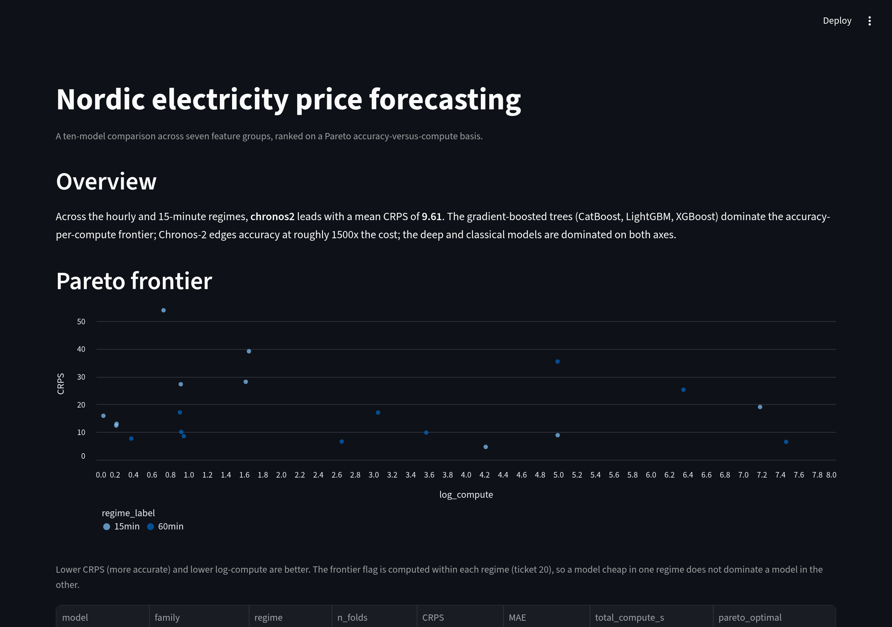
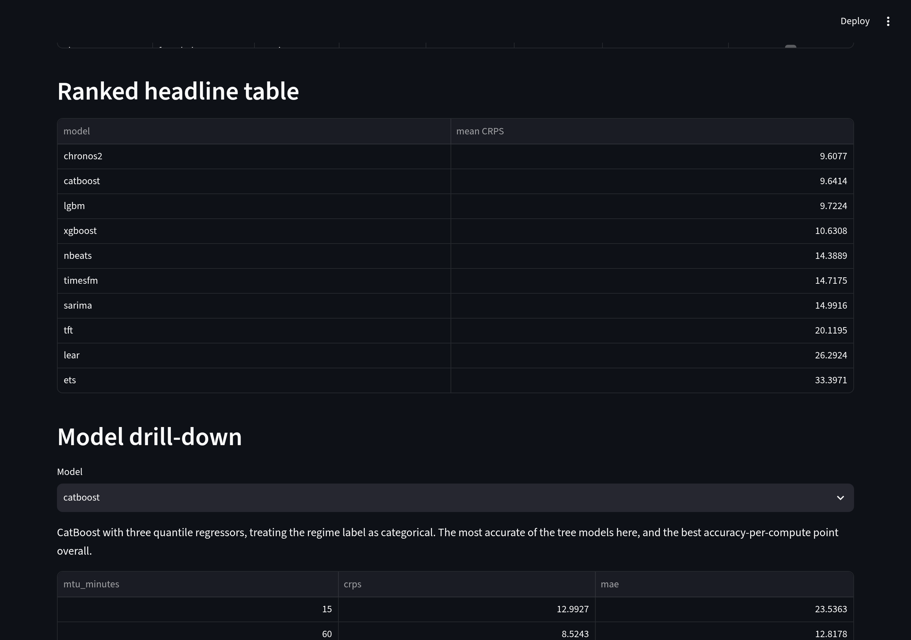
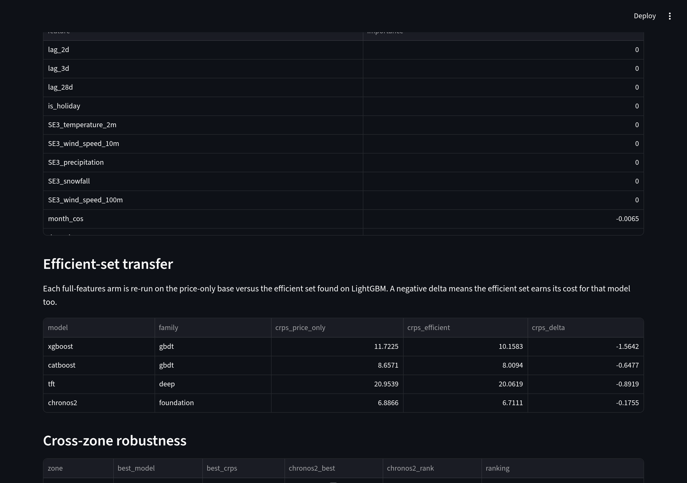

# Nordic electricity price forecasting

A ten-model comparison for day-ahead Nord Pool electricity prices, ranked on
a Pareto accuracy-versus-compute basis. The repository assembles the data,
engineers a leakage-free feature matrix, runs an expanding-window backtest
across the 60-minute and 15-minute market regimes, and reports which models
sit on the accuracy-per-compute frontier.

## Result

Mean across the hourly (three folds) and 15-minute (one fold) regimes, lower
is better on every accuracy column:

| model | family | CRPS | MAE | pinball (P50) | total compute |
|---|---|---|---|---|---|
| chronos2 | foundation | 9.61 | 15.45 | 7.73 | 3061.6 s |
| catboost | gbdt | 9.64 | 15.50 | 7.75 | 1.8 s |
| lgbm | gbdt | 9.72 | 15.37 | 7.68 | 0.5 s |
| xgboost | gbdt | 10.63 | 15.70 | 7.85 | 1.8 s |
| nbeats | deep | 14.39 | 18.40 | 9.20 | 38.6 s |
| timesfm | foundation | 14.72 | 21.33 | 10.66 | 17.5 s |
| sarima | classical | 14.99 | 21.69 | 10.85 | 166.6 s |
| tft | deep | 20.12 | 30.20 | 15.10 | 640.6 s |
| lear | ml | 26.29 | 26.29 | 13.15 | 2.5 s |
| ets | classical | 33.40 | 52.81 | 26.41 | 147.8 s |

The gradient-boosted trees (CatBoost, LightGBM, XGBoost) dominate the
accuracy-per-compute frontier: they reach CRPS within 0.1–1.0 of Chronos-2 at
roughly a thousandth of the compute. Chronos-2 edges the trees on mean CRPS by
about 0.5%, but a Diebold–Mariano test on the three hourly folds does not find
that edge significant, and the edge costs roughly three orders of magnitude
more compute. Four models (SARIMA, TFT, LEAR, ETS) score below a seasonal-naive
baseline, so they are worse than repeating last week's price. The full metric
set — CRPS, MAE, the P10/P50/P90 pinball decomposition, the skill score,
per-regime results, and the pairwise Diebold–Mariano tests — is in `REPORT.md`.

## App

`app.py` is a single-page Streamlit explorer of the snapshot. It renders the
headline ranking, the Pareto scatter, a per-model drill-down, and the feature
selection results.

<table>
<tr>
  <td></td>
  <td></td>
  <td></td>
</tr>
<tr>
  <td align="center">Overview and Pareto frontier</td>
  <td align="center">Ranked table and drill-down</td>
  <td align="center">Feature exploration</td>
</tr>
</table>

Run it with `uv run streamlit run app.py`.

## Key findings

- **Feature selection** — forward selection finds cross-border flow to be the
  dominant exogenous group (it cuts CRPS by 1.68); weather and hydro add less,
  carbon does not help. The efficient set is the base group plus cross-border,
  and a transfer check confirms it earns its cost on every full-features arm.
- **Tuning** — a secondary pass tunes the best model per family. None of the
  tuned configurations beat the pinned default on the hourly regime.
- **Cross-zone** — the frontier (the three trees) plus Chronos-2 generalise
  across SE1–SE4; Chronos-2 leads every zone.

## Methodology

- **Data** — ENTSO-E (cross-border, hydro), Open-Meteo (weather), ECB (EUR/SEK),
  EEX (EUA carbon), joined at a single `assemble_data` seam with a Parquet
  cache so a re-run does not re-fetch.
- **Features** — seven groups on a no-leakage as-of timing rule, because a
  model that sees a value published after its forecast time looks good in a
  backtest and fails in production. Boundary masking zeroes lags and rolling
  windows that cross a regime switch.
- **Backtest** — expanding walk-forward with yearly refit and a 7-day purge,
  which reproduces how a forecaster is actually used: train on the past,
  forecast the next day, never across a structural break.
- **Roster** — four families (classical, gradient-boosted, deep, foundation),
  ten models, every arm pinned to seed 42 so the comparison is reproducible.

The full methodology, metric definitions with formulas, and the decision
record are in `REPORT.md` and `docs/adr/`.

## Replication

The snapshot holds every matrix and result table needed to reproduce the
figures offline, with no API key.

```bash
uv sync
uv run python -c "from forecast_pipeline.snapshot import load_results, headline_ranking; \
print(headline_ranking(load_results()['results']).to_string(index=False))"
```

To rebuild the snapshot from the cached data window (no API key):

```bash
uv run python -m forecast_pipeline.snapshot --build
```

To run the full comparison from scratch, an ENTSO-E API key is required in
`.env`:

```bash
set -a && source .env && set +a
uv run python -m forecast_pipeline.bakeoff --zones SE3 --start 2021-01-01 --end 2026-08-13
```

## Full narrative

- `REPORT.md` — the complete benchmark report.
- `notebooks/01_data_features_regimes.ipynb` — data, features, regime
  detection, feature selection.
- `notebooks/02_backtest_comparison_pareto.ipynb` — comparison, tuning,
  cross-zone, Pareto frontier.
- `app.py` — the Streamlit explorer.
